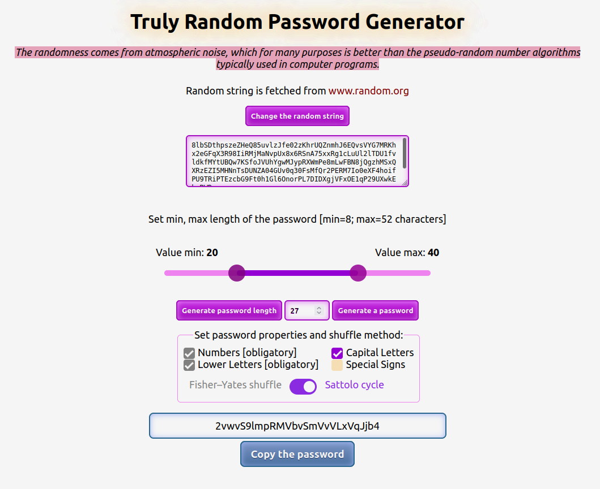

# Truly-Random-Password-Generator

Truly Random Password generator: generates passwords based on truly random strings (the randomness comes from
[atmospheric noise](https://en.wikipedia.org/wiki/Atmospheric_noise)).

Link to the application: [https://test-proj-gda3.web.app/](https://test-proj-gda3.web.app/)

## Description

The application gets a string of true random characters from <https://www.random.org/>. Later, you can choose a random
password length (between min and max) or set the password length. Then you can adjust the password settings: small / large
letters, numbers and signs. After that you select a shuffle method: Fisher-Yates or Sattolo cycle to generate a password that
you can copy to the clipboard.

## Notes/ ToDo List/ Issues

1. You can fetch 200,000 bits per day from <https://www.random.org/>.

## ScreenShot

## Built With

- The shuffle algorithms were taken from: [Rosetta Code](https://www.rosettacode.org/wiki/Rosetta_Code).

## License

[MIT](https://choosealicense.com/licenses/mit/)
